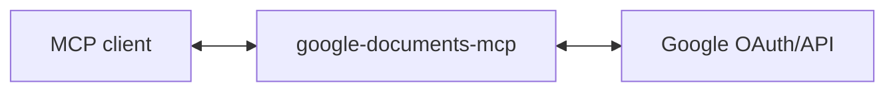

# google-documents-mcp

MCP server for Google Docs - read and edit documents.

## Use Cases

**Document Q&A**: "What does the contract say about termination clauses?" → reads the doc and pulls out the relevant section.

**Meeting-to-doc workflow**: After a call, reads the Gemini transcript plus follow-up Slack discussion, then updates your team charter with the decisions made.

**Release announcement**: "Draft a blog post about the new feature based on the GitHub PRs and Slack discussions in #proj-awesome" → synthesizes technical changes into user-facing content.

**Daily planning with persistent context**: Your AI assistant reads a "planning log" doc at the start of each day, asks about yesterday's progress, helps you identify today's priority, then updates the doc with your plan. Context carries over across sessions - it remembers what you said you'd do and can follow up.

(These are just examples - any workflow that needs document reading or editing can use this. Use in combination with [google-drive-mcp](https://github.com/domdomegg/google-drive-mcp) for finding files, deleting, comments, and sharing permissions.)

## Setup

### 1. Create Google OAuth credentials

1. Go to [Google Cloud Console](https://console.cloud.google.com/)
2. Create a new project (or use existing)
3. Enable the Google Docs API
4. Go to **APIs & Services** → **OAuth consent screen**, set up consent screen
5. Go to **APIs & Services** → **Credentials** → **Create Credentials** → **OAuth client ID**
6. Choose **Web application**
7. Add `http://localhost:3000/callback` to **Authorized redirect URIs**
8. Note your Client ID and Client Secret

### 2. Run the server

```bash
GOOGLE_CLIENT_ID='your-client-id' \
GOOGLE_CLIENT_SECRET='your-client-secret' \
MCP_TRANSPORT=http \
npm start
```

The server runs on `http://localhost:3000` by default. Change with `PORT=3001`.

### 3. Add to your MCP client

```bash
claude mcp add --transport http google-documents-mcp http://localhost:3000/mcp
```

## Architecture

This server acts as an **OAuth proxy** to Google:



1. Server advertises itself as an OAuth authorization server via `/.well-known/oauth-authorization-server`
2. `/register` returns the Google OAuth client credentials
3. `/authorize` redirects to Google, encoding the client's callback URL in state
4. `/callback` receives the code from Google and forwards to the client's callback
5. `/token` proxies token requests to Google, injecting client credentials
6. `/mcp` handles MCP requests, using the bearer token to call Google Docs API

The server holds no tokens or state - it just proxies OAuth to Google.

## Tools

| Tool | Description |
|------|-------------|
| `document_get_raw` | Get full raw JSON structure (all tabs, formatting, headers, footers, styles) |
| `document_get_text` | Get plain text content of all tabs |
| `document_create` | Create a new blank document |
| `document_batch_update` | Apply multiple edits atomically (insert, delete, format, etc.) |
| `document_append` | Append text to end of document |
| `document_insert` | Insert text at a specific index |
| `document_replace` | Find and replace text |

### batch_update Request Types

The `document_batch_update` tool supports these operations:

- `insertText` - Insert text at a location
- `deleteContentRange` - Delete a range of content
- `replaceAllText` - Find and replace all occurrences
- `insertInlineImage` - Insert an image
- `insertTable` - Create a table
- `insertTableRow` / `insertTableColumn` - Add rows/columns to tables
- `deleteTableRow` / `deleteTableColumn` - Remove rows/columns from tables
- `insertPageBreak` - Add a page break
- `createNamedRange` / `deleteNamedRange` - Manage named ranges
- `createParagraphBullets` / `deleteParagraphBullets` - Manage bullet lists

## Google Docs API Scopes

- `documents` - Full access to read and edit documents

## Contributing

Pull requests are welcomed on GitHub! To get started:

1. Install Git and Node.js
2. Clone the repository
3. Install dependencies with `npm install`
4. Run `npm run test` to run tests
5. Build with `npm run build`

## Releases

Versions follow the [semantic versioning spec](https://semver.org/).

To release:

1. Use `npm version <major | minor | patch>` to bump the version
2. Run `git push --follow-tags` to push with tags
3. Wait for GitHub Actions to publish to the NPM registry.
